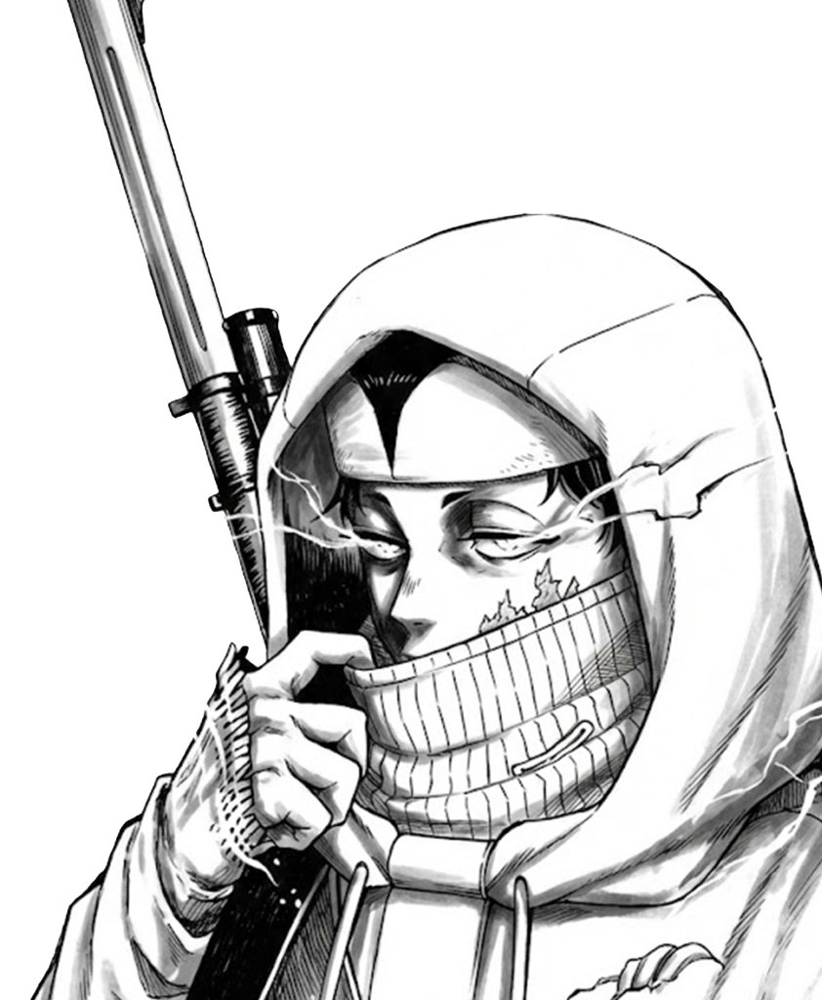

<!DOCTYPE html>
<html lang="en">
<head>
    <meta charset="UTF-8" />
    <meta name="viewport" content="width=device-width, initial-scale=1.0" />
    <title>Velazta Linktree</title>

    <link rel="stylesheet" href="style.css" />
    <link rel="stylesheet" href="https://cdnjs.cloudflare.com/ajax/libs/font-awesome/6.5.1/css/all.min.css">
</head>

<body>
    <main>
        

            <h1 class="main-title">VELAZTA</h1>
            
FOLLOW MY SOCIAL MEDIA

            

                <a href="https://instagram.com" target="_blank" rel="noopener noreferrer">
                    <i class="fa-brands fa-instagram"></i>
                </a>
                
                <a href="https://tiktok.com" target="_blank" rel="noopener noreferrer">
                    <i class="fa-brands fa-tiktok"></i>
                </a>
                
                
                
                <a href="https://discord.com" target="_blank" rel="noopener noreferrer">
                    <i class="fa-brands fa-discord"></i>
                </a>
            

            

                <a href="#" class="btn-custom">
                    SUPPORT ME
                </a>
            

        

        

            

            
        

        

            
        

    </main>
</body>
</html>

@import url('https://fonts.googleapis.com/css2?family=Bebas+Neue&display=swap');

/* Reset Dasar */
* {
    margin: 0;
    padding: 0;
    box-sizing: border-box;
}

body {
    height: 100vh;
    width: 100%;
    background: linear-gradient(180deg, #000000 0%, #303030 50%, #7B7B7B 100%);
    overflow: hidden; 
    font-family: 'Bebas Neue', sans-serif;
    z-index: 1;
}

/* --- Posisi Konten di Kiri --- */
.container-left {
    position: absolute;
    top: 50%;             
    left: 7%;            
    transform: translateY(-40%); 
    z-index: 5;
    /* Opsional: Batasi lebar agar tidak terlalu melebar ke kanan */
    max-width: 800px; 
}

/* --- Styling Teks VELAZTA (Diperkecil) --- */
.main-title {
    font-size: 14rem;      /* UPDATE: Dikecilkan dari 14rem */
    line-height: 0.9;     
    margin-bottom: 30px;   /* UPDATE: Jarak dirapatkan */
    
    background: linear-gradient(to bottom, #999999 30%, #ffffff 100%);
    -webkit-background-clip: text;
    background-clip: text;
    color: transparent;   
    letter-spacing: 0.3rem; /* UPDATE: Spasi huruf sedikit dikurangi */
    filter: drop-shadow(0 0 20px rgba(255, 255, 255, 0.4));
}

/* --- Styling Subtitle (Diperkecil) --- */
.subtitle {
    font-size: 2rem;    /* UPDATE: Dikecilkan dari 2.5rem */
    color: #e0e0e0;       
    letter-spacing: 4px;  
    text-transform: uppercase;
    margin-left: 10px;    /* UPDATE: Geser sedikit */
    margin-bottom: -15px;
    
    background: linear-gradient(to bottom, #999999, #ffffff);
    filter: drop-shadow(0 0 10px rgba(255, 255, 255, 0.3));
    -webkit-background-clip: text;
    background-clip: text;
    color: transparent;
}

/* --- Styling Ikon Sosial Media (Compact) --- */
.social-icons {
    display: flex;
    gap: 20px;            /* UPDATE: Jarak antar ikon dirapatkan */
    margin-left: 10px;    
    margin-top: 20px;     
    margin-bottom: 30px;  /* UPDATE: Jarak ke tombol dirapatkan */
    align-items: center; 
}

/* Style untuk Font (IG, Tiktok, Discord) */
.social-icons a i {
    color: white;
    font-size: 3.5rem;      /* UPDATE: Dikecilkan dari 4rem */
    transition: transform 0.3s ease, text-shadow 0.3s ease;
    filter: drop-shadow(0 0 8px rgba(255, 255, 255, 0.8));
}

/* Style KHUSUS untuk Gambar (Roblox) */
.social-icons a img.icon-img {
    width: 65px;          /* UPDATE: Dikecilkan agar seimbang dengan font 3rem */
    height: 65px;
    object-fit: contain;
    margin-bottom: -5px;  
    transition: transform 0.3s ease, filter 0.3s ease;
    filter: drop-shadow(0 0 8px rgba(255, 255, 255, 0.8));
}

/* --- EFEK HOVER ICON --- */
.social-icons a:hover i {
    transform: scale(1.2);
    text-shadow: 0 0 20px rgba(255, 255, 255, 0.9);
}

.social-icons a:hover img.icon-img {
    transform: scale(1.2);
    filter: drop-shadow(0 0 15px rgba(255, 255, 255, 0.9));
}

/* --- Styling Tombol CSS Custom (Diperkecil) --- */
.support-wrapper {
    margin-left: 10px; 
}

.btn-custom {
    display: inline-flex;
    justify-content: center;
    align-items: center;
    width: 280px;       /* UPDATE: Lebar dikecilkan dari 350px */
    padding: 15px 0;    /* UPDATE: Tinggi padding dikurangi */
    border-radius: 40px; 
    text-decoration: none;
    
    background: linear-gradient(to bottom, #737373 0%, #D9D9D9 100%);
    box-shadow: 0 0 10px rgba(255, 255, 255, 0.5), 
                0 5px 10px rgba(0,0,0,0.3);
    
    transition: all 0.3s ease;
    position: relative;
    overflow: hidden;
}

.btn-text {
    font-family: 'Bebas Neue', sans-serif;
    font-size: 1.8rem; /* UPDATE: Font tombol dikecilkan sedikit */
    letter-spacing: 2px;
    
    background: linear-gradient(to top, #ffffff 0%, #ffffff 100%);
    -webkit-background-clip: text;
    background-clip: text;
    color: transparent; 
    filter: drop-shadow(0 0 5px rgba(255, 255, 255, 0.5));
}

/* --- Efek Hover Tombol --- */
.btn-custom:hover {
    transform: scale(1.05); 
    box-shadow: 0 0 20px rgba(255, 255, 255, 0.8), 
                0 10px 20px rgba(0,0,0,0.4);
}

/* --- Styling Bottom Overlay Effect (Color Dodge) --- */
.bottom-overlay-container {
    position: absolute;
    bottom: 0;           /* Tempel di paling bawah layar */
    left: 0;
    width: 100%;         /* Lebar penuh */
    height: 70vh;        /* Tinggi saya naikkan sedikit agar gradasinya lebih naik */
    z-index: 1;         /* UPDATE: Naikkan z-index biar efeknya 'membakar' elemen di belakangnya */
    pointer-events: none; /* Klik tetap tembus */
    overflow: hidden;
    -webkit-mask-image: linear-gradient(to top, rgba(0,0,0,1) 0%, rgba(0,0,0,0) 80%);
    mask-image: linear-gradient(to top, rgba(0,0,0,1) 0%, rgba(0,0,0,0) 80%);
}

.overlay-img {
    width: 100%;
    height: 100%;
    object-fit: cover;   
    object-position: bottom; /* Pastikan bagian bawah gambar yang diambil */
    
    /* UPDATE PENTING: Menggunakan Color Dodge */
    mix-blend-mode: color-dodge;
    
    /* Penyesuaian agar efeknya maksimal */
    opacity: 1;          /* Color dodge butuh opacity tinggi biar nyala */
    filter: blur(0%) contrast(1); /* Tambah blur & kontras biar makin pendar */
}

/* --- Styling Container Kanan (Karakter & Petir) --- */
.container-right {
    position: absolute;
    top: 0;
    right: 0;
    width: 50%;          /* Mengambil separuh layar kanan */
    height: 100vh;       /* Tinggi penuh */
    z-index: 10 ;          /* Di atas background, tapi di bawah teks/overlay */
    overflow: hidden;    /* Agar gambar tidak keluar layar */
    pointer-events: none; /* Agar tidak menghalangi klik */
}

/* --- 1. Styling Karakter (Simo) --- */
.character-img {
    position: absolute;
    top: 50%;
    right: 0px;        /* Geser sedikit ke kanan biar artistik */
    transform: translateY(-50%); /* Posisi tengah vertikal */
    
    height: 120svh;        /* Tinggi karakter besar (90% layar) */
    width: auto;         /* Lebar menyesuaikan otomatis */
    object-fit: cover;
    z-index: 5;
    
    /* BLEND MODE: DIFFERENCE (Sesuai Request) */
    mix-blend-mode: difference; 
    
    /* Filter opsional untuk mempertajam hasil blend */
    /* grayscale(100%) agar hitam putih murni sebelum di-diff */
    filter: grayscale(100%) contrast(1.2); 
    
    opacity: 0.9;
}
.lightning-effect {
    position: absolute;
    top: 0;
    right: 0;
    width: 100%;
    height: 100%;
    
    /* Agar gambar memenuhi seluruh area container kanan */
    object-fit: cover; 
    
    /* PENTING: Blend Mode Screen */
    /* Hitam hilang, warna terang (hijau/putih) tetap menyala */
    mix-blend-mode: screen; 
    
    /* Z-Index lebih kecil dari karakter agar posisinya di belakang */
    z-index: 3; 
    
    /* Atur transparansi sesuai selera (0.1 - 1.0) */
    opacity: 0.8; 
}

/* --- Responsif (HP) --- */
@media (max-width: 768px) {
    .container-left {
        left: 50%;
        transform: translate(-50%, -50%);
        text-align: center;
        width: 100%;
        max-width: 100%;
    }
    
    .main-title { font-size: 5rem; }
    .subtitle { font-size: 1.2rem; margin-left: 0; }
    
    .social-icons {
        justify-content: center;
        margin-left: 0;
        gap: 20px;
    }
    
    .support-wrapper {
        margin-left: 0;
        display: flex;
        justify-content: center;
    }

    .btn-custom { width: 220px; padding: 12px 0; }
    .btn-text { font-size: 1.5rem; }

    .bottom-overlay-container {
        height: 35vh; 
    }

    .container-right {
        opacity: 0.2; /* Dibuat samar saja di HP */
        width: 100%;
        z-index: 1;
    }
    .character-img {
        right: -100px;
        height: 70vh;
    }
}